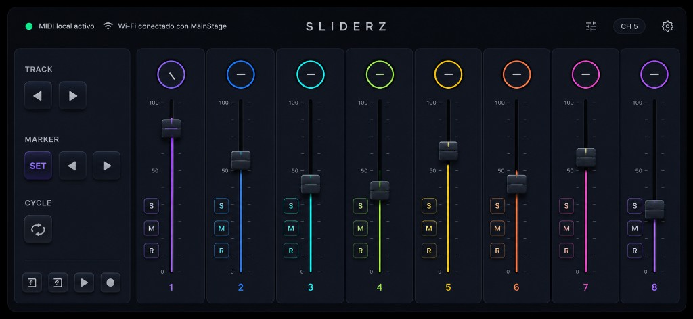

# Sliderz

A Flutter MIDI controller for iPhone and iPad, inspired by the KORG nanoKONTROL2. Control faders, knobs, transport, and channel buttons from your iOS device over **USB** to a Mac, DAW, or any MIDI-compatible app.



## Features

- **8 color-coded channel strips** — fader, pan knob, and Solo / Mute / Record buttons per channel
- **Transport panel** — track navigation, markers, cycle, and playback controls
- **USB MIDI** — send MIDI to a Mac over cable (IDAM / CoreMIDI)
- **nanoKONTROL2 CC mapping** — default control change assignments for DAW compatibility
- **Landscape-first UI** — dark neumorphic design optimized for performance use

## Requirements

- Flutter SDK `^3.11.5`
- iOS 13.1+ (primary target)
- iPhone or iPad connected to a Mac by **USB** for DAW or MIDI app control

## Getting started

```bash
git clone <your-repo-url>
cd sliderz
flutter pub get
flutter run
```

For a clean install after icon or native changes:

```bash
flutter clean && flutter pub get && flutter run
```

## Connect to a Mac (USB)

1. Connect iPhone/iPad to the Mac with a USB cable and tap **Trust** on the device.
2. On Mac: **Audio MIDI Setup** → **Window → Show MIDI Studio**.
3. Open **Audio Devices**, select the iPhone, and click **Enable** (IDAM).
4. In Sliderz, tap the **settings** icon and select the **iPhone** USB destination.
5. In your **DAW or MIDI app**, choose the **iPhone** MIDI input and map the controls.

Move a fader or knob in Sliderz and confirm MIDI arrives in your host app before mapping.

## MIDI CC mapping

Default assignments follow the nanoKONTROL2 CC mode:

| Control | CC |
|---------|-----|
| Faders 1–8 | 0–7 |
| Knobs 1–8 | 16–23 |
| Solo 1–8 | 32–39 |
| Mute 1–8 | 48–55 |
| Record 1–8 | 64–71 |
| Track ← / → | 40 / 41 |
| Marker SET / ← / → | 43 / 44 / 45 |
| Cycle | 42 |
| Rewind / FF / Stop / Play / Record | 46 / 47 / 58 / 59 / 60 |

MIDI channel is selectable from the status bar (default: channel 1).

## Project structure

```
lib/
├── main.dart
├── core/injector.dart           # Dependency injection
├── common/components/           # Shared UI (knob, fader, button)
├── controller/
│   ├── blocs/                   # Business logic
│   ├── components/              # Feature UI
│   ├── models/
│   └── screens/
├── midi/
│   ├── models/                  # CC mappings
│   └── services/                # MIDI I/O
└── theme/
```

## App icon

Icons are generated from `assets/app_icon.png` using [flutter_launcher_icons](https://pub.dev/packages/flutter_launcher_icons):

```bash
dart run flutter_launcher_icons
```

## Bundle identifier

- **iOS / Android:** `com.sliderz.app`

## Tech stack

- [Flutter](https://flutter.dev)
- [flutter_midi_command](https://pub.dev/packages/flutter_midi_command) — CoreMIDI over USB on iOS

## License

Private project — not published to pub.dev.
